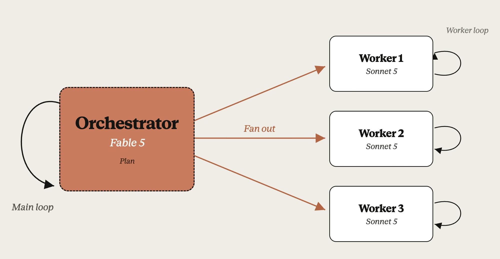
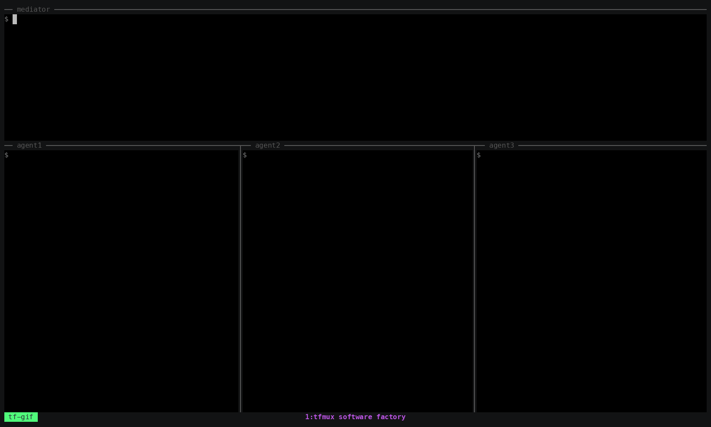

# tmux-factory

A software factory built with tmux: one orchestrator pane fans real coding-agent
sessions out into isolated git worktrees, and gets pinged back when each lands.

## The dream

You sit in one Claude session — **Fable**, the orchestrator — inside tmux. You
type one line:

```text
/tmux-factory-codex-go implement dark mode
```

and get back to what you were doing. A codex worker spins up in its own git
worktree: designs, implements, reviews, opens a PR, squash-merges to main.
Minutes later a line lands in *your* pane:

```text
dark-mode merged: https://github.com/you/repo/pull/42
```

Fire three at once; each reports back on its own. Your session stays clean — the
orchestrator plans, the workers burn the tokens.



## Install

macOS and Linux. Three steps.

**1. Install tmux.**

```bash
brew install tmux         # macOS
sudo apt install tmux     # Linux (Debian/Ubuntu)
```

**2. Install tfmux and the skills.**

```bash
git clone https://github.com/browseros-ai/tmux-factory && cd tmux-factory
./install.sh
```

`install.sh` cargo-installs the `tfmux` binary and copies the three skills into
`~/.claude/skills/`. No Rust? Run `curl --proto '=https' --tlsv1.2 -sSf
https://sh.rustup.rs | sh` first, then rerun `./install.sh`.

**3. Start Claude inside tmux and fire a task.**

```bash
tmux            # open a tmux session
cd <your-repo>  # any git repo
claude          # start Claude Code
```

```text
/tmux-factory-codex-go <your feature>
```

## The skills

| Skill | What it does |
|---|---|
| `/tmux-factory-claude-go <task>` | Fire a Claude Code session in a worktree; get pinged done or blocked. |
| `/tmux-factory-claude-opus-go <task>` | The same, on Opus at max effort. |
| `/tmux-factory-codex-go <feature>` | Full loop: design, implement, review, open PR, squash-merge to main, then ping. |

The first time you fire one, your pane is bound as the tfmux mediator and the
worker runs detached — you keep working. When it lands, a line arrives in your
pane as if someone typed it there:

```text
targets-json merged: https://github.com/you/repo/pull/43
```

Then `git pull` and keep going. `/tmux-factory-codex-go` needs `gh` installed and
authenticated.

**See it run first.** From inside tmux, `./demo.sh` spins up three workers that
report in without a single poll (tear down with `tmux kill-session -t tfmux-demo`).



## Under the hood

<details>
<summary><b>How it works</b></summary>

Two pieces:

- **`tfmux`** — a small synchronous Rust CLI that names tmux panes, delivers work
  into them (buffer, paste, Enter, then verifies the payload landed), and lets any
  pane send a line back to the mediator pane.
- **The skills** — `/tmux-factory-claude-go`, `/tmux-factory-claude-opus-go`,
  `/tmux-factory-codex-go`. Each spins up a worktree, spawns a detached agent
  session, delivers the task, and arms a ping back to your pane.

No daemon, no polling, no inbox or dashboard. State is a few JSON files under
`~/.tfmux`.

```text
                     your tmux window
        +---------------------------------------+
        |  mediator pane  (Claude, planning)    |
        +---------------------------------------+
             |                            ^
  task in    |                            |  "merged" / "blocked"
             v                            |
        +---------------------------------------+
        |  detached sessions, one per worker    |
        |  worker1  codex   feat-a              |
        |  worker2  claude  feat-b              |
        +---------------------------------------+
```

Each worker is bound to a stable name, so the mediator addresses it by name, not
by a pane id that moves. The ping back is the same mechanism in reverse — a worker
runs `tfmux send mediator --text "..."`.

</details>

<details>
<summary><b>What the skills assume</b></summary>

The skills are packaged as they run on the author's machine, and they assume more
than `tfmux` does. Each launcher preflights its dependencies and exits non-zero on
the first one missing.

| Assumed on `PATH` | Used for | Skills |
|---|---|---|
| `git`, `tmux`, `tfmux`, `python3` | worktree, panes, delivery, path resolution | all three |
| `wt` | creating the `feat/<slug>` worktree | all three |
| `dotllm` | giving the worktree a `.llm/` scratch directory | all three |
| `gh`, authenticated | opening and squash-merging the PR | `codex-go` |

Two assumptions are not probed by `command -v`:

- **Launch aliases.** At its default effort each launcher spawns a shell alias —
  `claudex`, `claudeo`, `codexy` — through `$SHELL -ic`. Pass `--effort` below the
  default to invoke `claude`/`codex` directly, or override with `SF_CLAUDEGO_CMD` /
  `SF_CODEXGO_CMD`.
- **`codex-go` needs the `shadowfax` bundle**, which supplies the `$sf-auto` loop
  in `~/.codex/skills/`. Without it codex gets the task but has no loop to run.

`wt`, `dotllm`, and `shadowfax` are not bundled here, and `tfmux` itself never
touches them.

**What a skill run does to your machine:**

- creates a git worktree **as a sibling of your repo** (`<repo>.feat-<slug>`) on a
  new `feat/<slug>` branch
- runs `dotllm init` inside it
- spawns a **detached tmux session** per run (`sf_<slug>_claude` / `sf_<slug>_codex`)
- writes target records under `~/.tfmux/<date>/tfmux-<slug>/`
- `codex-go` additionally opens a PR and **squash-merges it to `main`** on your remote

</details>

<details>
<summary><b>tfmux command reference</b></summary>

Run binding commands from inside tmux. On failure, `tfmux` prints
`error: <message>` to stderr and exits 1.

**bind** — bind a pane to a stable name.

```bash
tfmux bind <NAME> (--here | --tmux <TARGET>) [--role mediator|agent]
                  [--kind claude|codex|generic] [--session NAME]
                  [--socket NAME] [--json]
```

Exactly one pane source: `--here` binds the current pane (reads `TMUX_PANE`);
`--tmux <TARGET>` resolves any tmux target like `%5` or `demo:1.0`. `--role`
defaults to `agent`, `--kind` to `generic`. Creates the tfmux session on first use.

**send** — deliver a payload to a bound pane.

```bash
tfmux send <NAME> (--text <TEXT> | --file <FILE> | -) [--session NAME]
```

Exactly one input source; empty payloads fail. Before sending, `tfmux` re-resolves
the stored pane id and checks its metadata still matches — if the pane is gone or
changed, `send` fails and tells you to rebind.

**targets** — list bound panes and their liveness.

```bash
tfmux targets [--session NAME] [--json]
```

```text
NAME       ROLE     KIND     PANE   LOCATION       STATUS
agent1     agent    claude   %5     demo:1.0       live
mediator   mediator generic  %3     demo:0.0       live
```

`live` = pane id and stored metadata match; `stale` = pane resolves but its
session/window/pane metadata changed; `dead` = pane no longer resolves.

**attach** — open a detached worker in a new window.

```bash
tfmux attach <TMUX_SESSION> [--window-name NAME] [--socket NAME]
```

Run from inside tmux. Opens a new window running
`env -u TMUX tmux attach-session -t <TMUX_SESSION>`, so you can watch a worker.
Reads no factory state.

**unbind** — remove a target record from the selected session.

```bash
tfmux unbind <NAME> [--session NAME] [--json]
```

</details>

<details>
<summary><b>State and environment</b></summary>

A tfmux session groups the targets for one factory. There is no global "current
session" — identity travels with the pane. Stateful commands (`bind`, `send`,
`targets`, `unbind`) resolve it in order:

1. `--session NAME`
2. `TFMUX_SESSION`
3. First line of `.llm/tfmux-session` in the current directory

Target and session names must be single path-safe tokens: no spaces, slashes,
backslashes, tabs, or newlines. State lives under `$TFMUX_HOME` (else `~/.tfmux`),
and every write is atomic:

```text
~/.tfmux/2026-06-28/demo/
  session.json          # session name + creation timestamp
  targets/mediator.json # name, role, kind, pane id, tmux location, socket, timestamps
  targets/agent1.json
```

The date directory is the local calendar date the session was created.

| Variable | Effect |
|---|---|
| `TFMUX_SESSION` | Default tfmux session for stateful commands. |
| `TFMUX_HOME` | State root (default `~/.tfmux`). |
| `TFMUX_TMUX_BIN` | tmux binary to use (default: `tmux` on `PATH`). |
| `TFMUX_SOCKET` | tmux socket for `bind` and `attach`, below the `--socket` flag. |
| `TFMUX_MAIN_SOCKET` | Socket name treated as the default when derived from `TMUX`. |

Sockets rarely need attention: `bind --here` and `attach` derive the socket from
`TMUX`; `--socket` or `TFMUX_SOCKET` override it, and the chosen socket is stored on
the target so later `send`/`targets` calls reach the right server.

</details>

<details>
<summary><b>Troubleshooting</b></summary>

- **"attach requires TMUX" / "--here requires TMUX and TMUX_PANE".** Run inside
  tmux, or bind by explicit target with `--tmux %5`.
- **A worker pane died and `send` fails.** Run `tfmux targets` — it shows `dead` or
  `stale`. Rebind: `tfmux bind agent1 --tmux <new-target>`.
- **"no tfmux session selected".** Pass `--session NAME`, export `TFMUX_SESSION`, or
  put the name on the first line of `.llm/tfmux-session`. Workers need the *same*
  session context as the mediator, or their ping has nowhere to land.
- **The `/tmux-factory-*` skills do not show up.** Restart Claude Code — skills are
  read at startup, and `install.sh` copies them in after yours is already running.
- **Demo workers sit idle.** The `claude` CLI is installed but not authenticated.
  Run `claude` once, sign in, then re-run `./demo.sh`. With no agent CLI at all, the
  demo falls back to plain-shell workers and still pings.
- **tmux is somewhere unusual.** `export TFMUX_TMUX_BIN=/path/to/tmux`.

</details>

## Development

```bash
cargo test
cargo fmt --check
cargo clippy --all-targets -- -D warnings
```

Run `cargo fmt` before committing. See `CLAUDE.md` for contributor rules and
module ownership.
